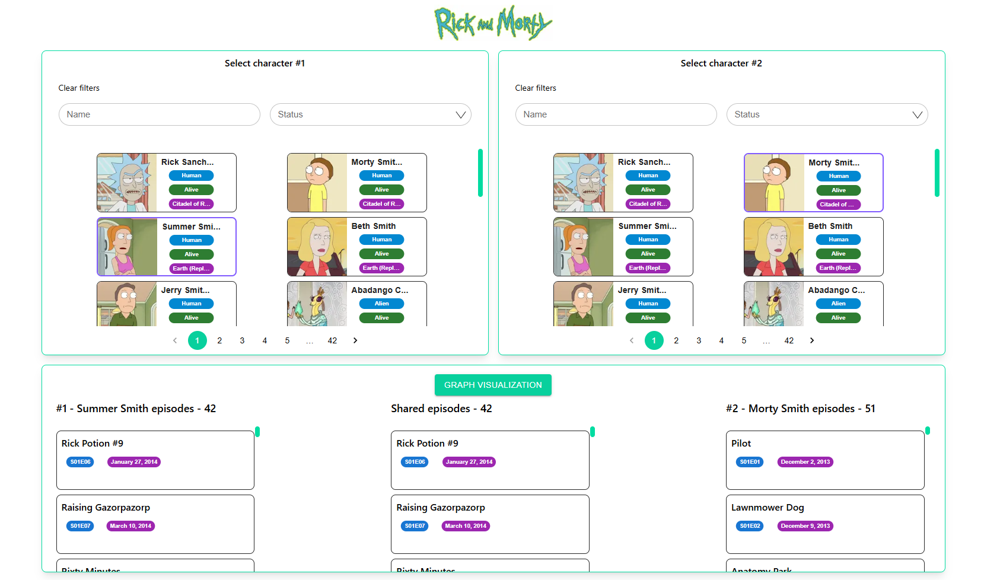
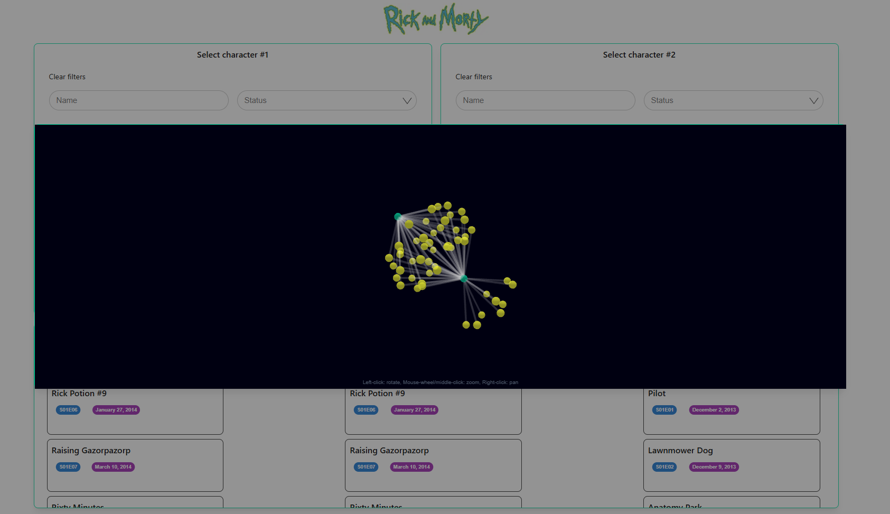

# Conexa challenge

<div align="center">

</div>

 <div align="left">

[Deploy](https://conexa-challenge-front.netlify.app/)

</div>

Solution of Conexa challenge.

First you'll have to clone the repo. Open a terminal and paste this command.

```bash
git clone https://github.com/rodrigoperez01093/conexa-challenge.git
```

<br>

Inside conexa-challenge folder run:

```bash
npm install
```

Follow by

```bash
npm run dev
```

Open a window and navigate to <http://localhost:3000>

---

<div align="center">



</div>

<div align="center">



</div>

<br>

<h1> Author </h1>

Rodrigo Perez

- [Linkedin](https://www.linkedin.com/in/rodrigo-perez-full-stack-developer/)
- [Github](https://github.com/rodrigoperez01093)
